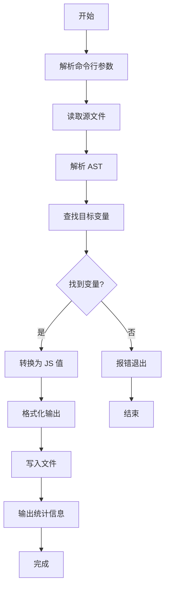

# JavaScript 变量提取 Skill

## 描述

这个 skill 帮助你使用 `scripts/extract-variable.js` 脚本从 JavaScript 文件中提取指定变量，并将其输出为 JSON 文件。该脚本基于 ESTree 规范的 AST 解析，能够准确提取静态数据。

## AI 使用规则

当用户请求提取变量时，AI 应遵循以下规则：

### 触发条件

当用户引用一个文件并声明"提取 + 变量名"时，应立即调用此 skill 帮助完成提取工作。

**触发示例**：

- "从 data.js 提取 items 变量"
- "提取 data.js 中的 MONSTER_DATA"
- "帮我提取 src/config.js 里的 CONFIG 变量"

### 默认配置

| 配置项   | 默认值             | 说明                                  |
| -------- | ------------------ | ------------------------------------- |
| 输出目录 | `scripts/data/`    | 所有提取的 JSON 文件统一输出到此目录  |
| 输出格式 | `pretty`           | 使用格式化 JSON，便于阅读和版本控制   |
| 文件命名 | 根据变量名智能命名 | AI 应根据变量用途选择合适的英文文件名 |

### 文件命名规则

AI 应根据变量的语义和用途，为输出文件选择合适的名称：

1. **优先使用变量原名的小写形式**：
   - `ITEM_DATA` → `items.json`
   - `MONSTER_CONFIG` → `monsters.json`

2. **根据变量语义调整**：
   - `data`（包含物品数据）→ `items.json`
   - `config`（游戏配置）→ `game-config.json`
   - `list`（技能列表）→ `skills.json`

3. **命名规范**：
   - 使用小写字母
   - 多个单词用连字符 `-` 连接
   - 避免使用通用名称如 `data.json`、`config.json`（除非确实合适）

### 执行流程

当收到提取请求时，AI 应：

1. **确认源文件路径**：获取用户指定的 JavaScript 文件路径
2. **确认变量名**：获取要提取的变量名称
3. **确定输出文件名**：根据命名规则选择合适的文件名
4. **执行提取命令**：
   ```bash
   node scripts/extract-variable.js <源文件路径> <变量名> scripts/data/<输出文件名>.json
   ```
5. **报告结果**：告知用户提取是否成功，输出文件位置

### 示例对话

**用户**：从 `kubition-advanture/src/data.js` 提取 `items` 变量

**AI 行为**：

1. 识别源文件：`kubition-advanture/src/data.js`
2. 识别变量名：`items`
3. 确定输出文件名：`items.json`（变量名已足够清晰）
4. 执行命令：
   ```bash
   node scripts/extract-variable.js ./kubition-advanture/src/data.js items scripts/data/items.json
   ```
5. 报告：✅ 已成功提取 `items` 变量到 `scripts/data/items.json`

## 功能特性

- 基于 AST 解析，准确提取 JavaScript 变量
- 支持多种数据类型：对象、数组、字符串、数字等
- 支持两种输出格式：`pretty`（格式化 JSON）和 `jsonlines`（每行一条数据）
- 自动创建输出目录
- 支持相对路径和绝对路径

## 使用方法

### 基本用法

```bash
node scripts/extract-variable.js <源文件路径> <变量名> [输出文件路径] [--format=pretty|jsonlines]
```

### 参数说明

| 参数             | 必填 | 说明                                                    |
| ---------------- | ---- | ------------------------------------------------------- |
| `<源文件路径>`   | 是   | 要解析的 JavaScript 文件路径                            |
| `<变量名>`       | 是   | 要提取的变量名称                                        |
| `[输出文件路径]` | 否   | 输出 JSON 文件路径，默认为 `scripts/data/<变量名>.json` |
| `--format`       | 否   | 输出格式：`pretty`（默认）或 `jsonlines`                |

### 输出格式说明

| 格式        | 说明                          | 适用场景                     |
| ----------- | ----------------------------- | ---------------------------- |
| `pretty`    | 标准格式化 JSON，带缩进和换行 | 人类阅读、调试、小型数据集   |
| `jsonlines` | JSON Lines 格式，每行一条数据 | 大数据集、流式处理、数据分析 |

## 使用示例

### 示例 1：基本提取

```bash
# 从 src/data_item.js 提取 ITEM_DATA 变量
node scripts/extract-variable.js ./src/data_item.js ITEM_DATA
# 输出：scripts/data/ITEM_DATA.json
```

### 示例 2：指定输出路径

```bash
# 指定输出文件路径
node scripts/extract-variable.js ./src/data_item.js ITEM_DATA ./output/items.json
```

### 示例 3：使用 JSON Lines 格式

```bash
# 输出为 JSON Lines 格式（适合大数据集）
node scripts/extract-variable.js ./src/data_item.js ITEM_DATA ./output/items.json --format=jsonlines
```

## 支持的数据类型

脚本支持以下 JavaScript 数据类型的提取：

| 类型           | 说明                   | 示例                           |
| -------------- | ---------------------- | ------------------------------ |
| 对象           | 嵌套对象、扁平对象     | `{ name: "test", value: 1 }`   |
| 数组           | 一维或多维数组         | `[1, 2, 3]` 或 `[[1, 2], [3]]` |
| 字符串         | 普通字符串、模板字符串 | `"hello"` 或 `` `world` ``     |
| 数字           | 整数、浮点数、负数     | `42`, `3.14`, `-1`             |
| 布尔值         | true / false           | `true`, `false`                |
| null/undefined | null 和 undefined      | `null`, `undefined`            |

## 工作流程



## 最佳实践

### 1. 变量命名规范

- 使用大写字母和下划线命名常量数据：`ITEM_DATA`, `MONSTER_CONFIG`
- 变量应在文件顶层声明（支持 `const`、`let`、`var`）
- 支持 `export` 导出的变量

### 2. 数据结构建议

```javascript
// ✅ 推荐：纯静态数据，可被完整提取
const ITEM_DATA = {
  sword: { name: '铁剑', attack: 10 },
  shield: { name: '木盾', defense: 5 },
}

// ❌ 不推荐：包含动态表达式，无法静态提取
const ITEM_DATA = {
  sword: { name: '铁剑', attack: getAttack() }, // 函数调用无法提取
}
```

### 3. 输出格式选择

- **小型数据集（< 1000 条）**：使用 `pretty` 格式，便于阅读和版本控制
- **大型数据集（≥ 1000 条）**：使用 `jsonlines` 格式，便于流式处理和数据分析

### 4. 文件组织

```
scripts/
├── extract-variable.js    # 提取脚本
└── data/                  # 默认输出目录
    ├── ITEM_DATA.json
    ├── MONSTER_DATA.json
    └── ...
```

## 常见问题

### Q1: 提示"未找到变量"怎么办？

**原因**：

- 变量名拼写错误
- 变量未在文件顶层声明
- 变量声明时没有初始化值

**解决方案**：

```bash
# 检查变量名是否正确
grep -n "const ITEM_DATA" ./src/data_item.js

# 确保变量有初始化值
const ITEM_DATA = { ... }  # ✅
const ITEM_DATA;           # ❌ 无法提取
```

### Q2: 提取的数据包含 `[ref:xxx]` 是什么意思？

**原因**：变量中引用了其他变量或函数调用，无法静态解析。

**解决方案**：将数据改为纯静态值，或手动处理这些引用。

### Q3: 如何提取 TypeScript 文件中的变量？

**现状**：脚本目前仅支持 JavaScript 文件。

**解决方案**：

1. 将 TypeScript 编译为 JavaScript 后提取
2. 或直接从源码中手动复制数据

## 注意事项

1. **依赖要求**：需要安装 `acorn` 和 `acorn-walk` 依赖

   ```bash
   pnpm add acorn acorn-walk --save-dev
   ```

2. **路径处理**：源文件路径相对于当前工作目录

3. **数据限制**：只能提取静态数据，无法提取：
   - 函数调用结果
   - 变量引用
   - 运行时计算的值

4. **编码格式**：输出文件统一使用 UTF-8 编码

## 快速参考

### 常用命令

```bash
# 提取变量到默认位置
node scripts/extract-variable.js <源文件> <变量名>

# 提取并指定输出路径
node scripts/extract-variable.js <源文件> <变量名> <输出路径>

# 使用 JSON Lines 格式
node scripts/extract-variable.js <源文件> <变量名> --format=jsonlines

# 查看帮助
node scripts/extract-variable.js
```

### 输出示例

**pretty 格式**：

```json
{
  "sword": {
    "name": "铁剑",
    "attack": 10
  },
  "shield": {
    "name": "木盾",
    "defense": 5
  }
}
```

**jsonlines 格式**：

```json
{"sword":{"name":"铁剑","attack":10}}
{"shield":{"name":"木盾","defense":5}}
```
