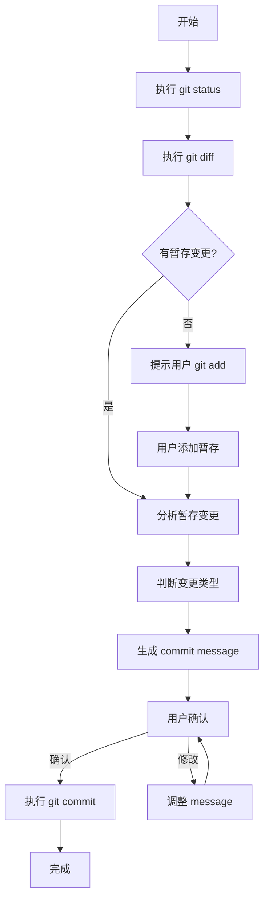

# Git Commit Skill

## 描述

这个 skill 帮助你生成符合 Conventional Commits 规范的 Git 提交信息，自动分析代码变更并生成合适的 commit message。

## 功能特性

- 自动分析 `git diff` 和 `git status` 输出
- 根据文件变更类型推断 commit 类型
- 生成符合 Conventional Commits 规范的提交信息
- 支持所有标准 commit 类型
- 提供详细的变更分析
- 提交完成后对本次变更作出专业性评价

## Commit 类型说明

| 类型       | 说明                                              | 示例                           |
| ---------- | ------------------------------------------------- | ------------------------------ |
| `feat`     | 新功能                                            | feat: 添加用户登录功能         |
| `fix`      | Bug 修复                                          | fix: 修复登录验证失败的问题    |
| `docs`     | 文档变更                                          | docs: 更新 README 安装说明     |
| `style`    | 代码格式（不影响代码运行的变动）                  | style: 格式化代码缩进          |
| `refactor` | 重构（既不是新增功能，也不是修改 bug 的代码变动） | refactor: 重构用户服务代码     |
| `perf`     | 性能优化                                          | perf: 优化列表渲染性能         |
| `test`     | 增加测试                                          | test: 添加用户服务单元测试     |
| `chore`    | 构建过程或辅助工具的变动                          | chore: 更新依赖版本            |
| `ci`       | CI 配置文件和脚本的变动                           | ci: 添加 GitHub Actions 工作流 |
| `revert`   | 回滚之前的 commit                                 | revert: 回滚用户登录功能       |

## 使用指南

### 步骤 1: 分析代码变更

首先执行以下命令获取变更信息：

```bash
git status
git diff --staged
git diff
```

### 步骤 2: 确定变更类型

根据以下规则判断 commit 类型：

1. **新增文件判断**：
   - 如果是全新的功能文件 → `feat`
   - 如果是测试文件 → `test`
   - 如果是配置文件 → `chore`

2. **修改文件判断**：
   - 如果修改的是 bug 相关代码 → `fix`
   - 如果是代码重构（不改变功能）→ `refactor`
   - 如果是性能优化 → `perf`
   - 如果是文档文件 → `docs`
   - 如果是样式/格式调整 → `style`
   - 如果是构建/工具配置 → `chore`

3. **删除文件判断**：
   - 删除功能代码 → `feat` (带 `!` 表示破坏性变更)
   - 删除废弃代码 → `refactor`

### 步骤 3: 生成 Commit Message

#### 基本格式

```
<type>[optional scope]: <description>

[optional body]

[optional footer(s)]
```

#### 示例

**简单提交**：

```
feat: 添加用户登录功能
```

**带作用域**：

```
feat(auth): 添加 JWT 令牌验证
```

**带详细说明**：

```
feat: 添加用户登录功能

- 实现邮箱密码登录
- 添加登录状态持久化
- 集成第三方 OAuth 登录
```

**破坏性变更**：

```
feat!: 重构用户认证系统

BREAKING CHANGE: 旧的登录 API 已废弃，请使用新的认证接口
```

### 步骤 4: 执行提交

生成 commit message 后，执行：

```bash
git commit -m "commit message"
```

## 最佳实践

### Commit Message 编写原则

1. **使用祈使句**：使用 "添加" 而不是 "添加了"
2. **首字母小写**：中文直接开始，英文首字母小写
3. **不结尾句号**：subject 行末尾不加句号
4. **简洁明了**：subject 控制在 50 字符以内
5. **解释原因**：body 部分解释 what 和 why，而不是 how

### 变更分析技巧

1. **查看文件路径**：文件路径通常能反映变更类型
   - `src/components/` → UI 相关变更
   - `src/utils/` → 工具函数变更
   - `tests/` → 测试相关
   - `docs/` → 文档变更

2. **分析 diff 内容**：
   - 新增大量代码 → `feat`
   - 修改条件判断/修复逻辑 → `fix`
   - 变量重命名/代码移动 → `refactor`
   - 删除代码 → `refactor` 或 `feat!`

3. **结合 commit 历史**：
   - 使用 `git log --oneline -10` 查看最近的提交风格
   - 保持项目 commit 风格一致性

## 工作流程



## 注意事项

1. **检查暂存区**：确保只提交预期的文件
2. **避免大 commit**：一个 commit 只做一件事
3. **敏感信息检查**：不要提交密钥、密码等敏感信息
4. **遵循项目规范**：如果项目有特殊的 commit 规范，优先遵循
5. **husky hooks**：本项目配置了 commitlint，会自动验证 commit message 格式

## 快速参考

### 常用命令

```bash
# 查看状态
git status

# 查看暂存的变更
git diff --staged

# 查看未暂存的变更
git diff

# 添加文件到暂存区
git add <file>
git add .

# 提交
git commit -m "type: description"

# 修改上次提交
git commit --amend

# 查看提交历史
git log --oneline -10
```

### Commitlint 规则

本项目使用 `@commitlint/config-conventional`，主要规则：

- type 必须是预定义类型之一
- subject 不能为空
- subject 不能以句号结尾
- type 和 subject 之间用冒号和空格分隔
- body 和 footer 可选
